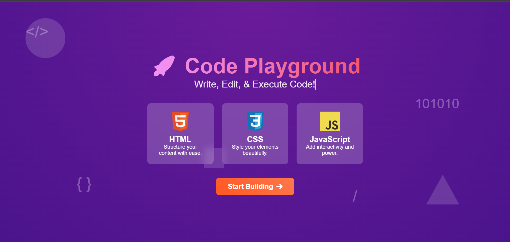
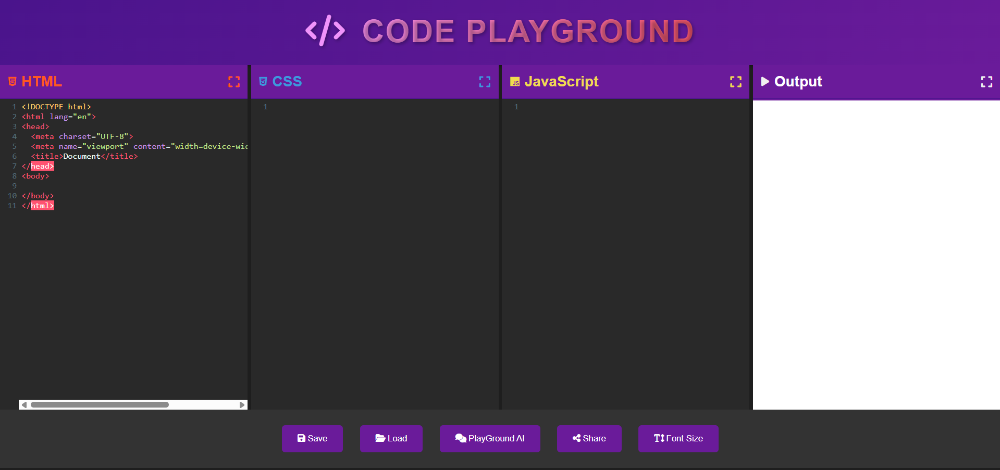

# Code Playground

Code Playground is an interactive web environment for writing, testing, and sharing code snippets in real-time.

## Overview

Code Playground provides developers with a seamless coding experience, allowing them to experiment with HTML, CSS, and JavaScript in a powerful, intuitive interface. With cloud saving capabilities and AI assistance, Code Playground streamlines the development process from ideation to sharing.

## Key Features

- **Real-time Code Execution**: Instantly see the results of your code as you type
- **Code Sharing**: Generate unique links to share your creations with others
- **Cloud Storage**: Save your projects securely to access them from anywhere
- **AI Chat Assistant**: Get coding help and suggestions through our integrated AI bot
- **Multi-language Support**: Work with HTML, CSS, JavaScript, and more
- **Responsive Design**: Create and test responsive layouts with ease

## Screenshots

### Landing Page

*The landing page introduces users to Code Playground and its core features*

### Home Dashboard

*The dashboard interface where users can access and manage their projects*

## Getting Started

### Prerequisites
- Node.js (v14.0.0 or higher)
- npm or yarn

### Installation
1. Clone the repository
```bash
git clone https://github.com/yourusername/code-playground.git
```

2. Navigate to the project directory
```bash
cd code-playground
```

3. Install dependencies
```bash
npm install
# or
yarn install
```

4. Start the development server
```bash
npm run dev
# or
yarn dev
```

5. Open your browser and visit `http://localhost:3000`

## Technologies Used

- **Frontend**: React.js, CodeMirror, Tailwind CSS
- **Backend**: Node.js, Express
- **Database**: MongoDB
- **Authentication**: JWT, OAuth
- **Cloud Storage**: AWS S3
- **AI Integration**: OpenAI API

## Roadmap

- [ ] Add support for additional programming languages
- [ ] Implement collaborative editing features
- [ ] Create customizable themes and layouts
- [ ] Develop project templates for common use cases
- [ ] Add version control functionality

## Contributing

Contributions are welcome! Please feel free to submit a Pull Request.

1. Fork the project
2. Create your feature branch (`git checkout -b feature/AmazingFeature`)
3. Commit your changes (`git commit -m 'Add some AmazingFeature'`)
4. Push to the branch (`git push origin feature/AmazingFeature`)
5. Open a Pull Request

## License

This project is licensed under the MIT License - see the LICENSE file for details.

## Acknowledgments

- Thanks to all contributors who have helped shape Code Playground
- Special appreciation to the open-source community for providing the tools and libraries that make this project possible
